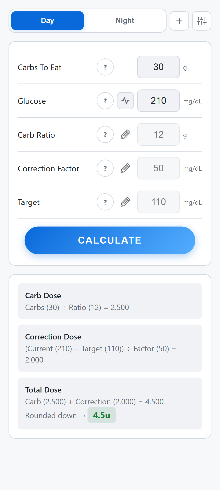
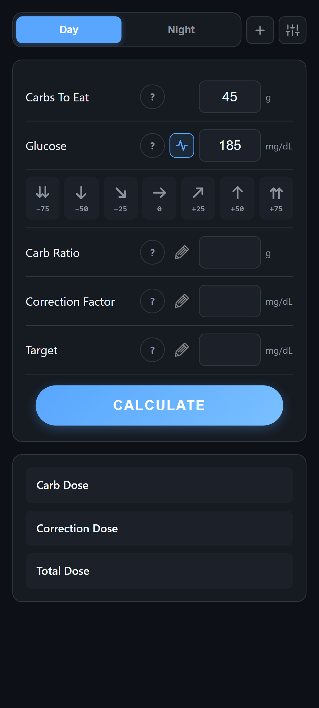
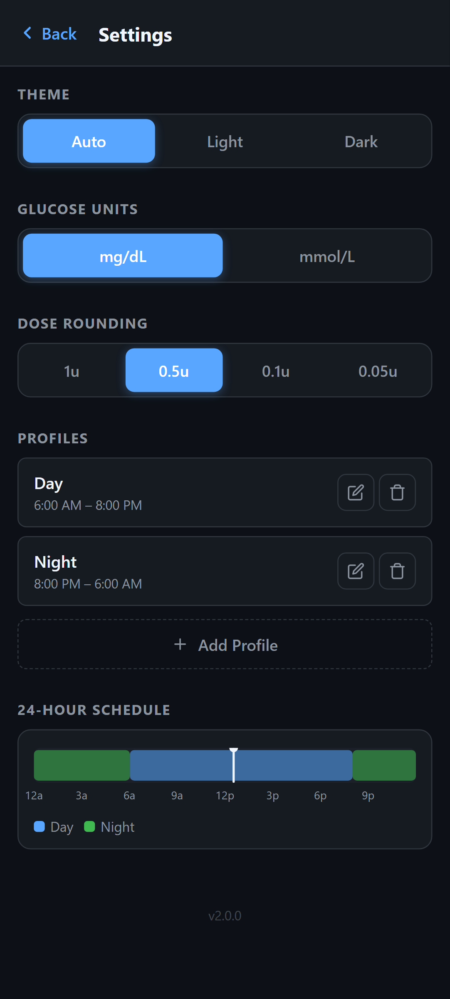
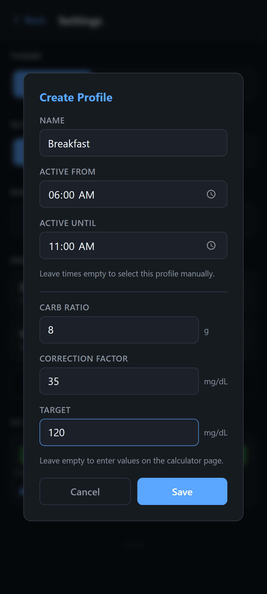
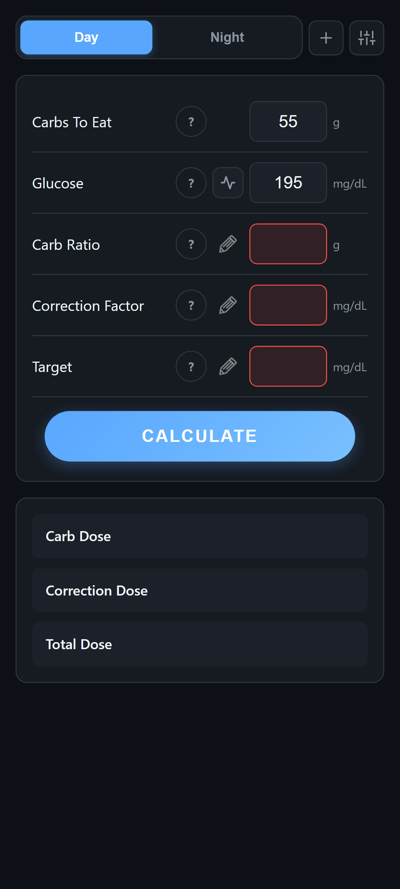

# Insulin Calculator

A fast, private insulin dose calculator for Android — built by a parent of a child with Type 1 diabetes.

<a href="https://play.google.com/store/apps/details?id=com.TeraFlop.InsulinCalc&hl=en_US">
  
</a>

## Screenshots

<p align="center">
  
  
  
  
  
  
</p>

## Features

- **Insulin Dose Calculation** — Computes carb dose, correction dose, and total dose based on your inputs
- **Dexcom CGM Trend Arrows** — Factor in glucose trends (from rapidly rising to rapidly falling) for more accurate dosing
- **Multiple Profiles** — Create profiles for breakfast, lunch, dinner, etc. with per-profile carb ratio, correction factor, and target
- **24-Hour Schedule** — Assign profiles to time ranges for automatic switching throughout the day
- **Dose Rounding** — Round to 1u, 0.5u, 0.1u, or 0.05u to match your pen or pump precision
- **mg/dL & mmol/L** — Switch glucose units anytime; all values and trend adjustments update automatically
- **Dark & Light Themes** — Dark mode, light mode, or auto (follows system setting)
- **100% Private** — No accounts, no data collection, no internet required. All data stays on your device.

## Building from Source

### Prerequisites

- **JDK 17+**
- **Android SDK 35** (platform + build-tools)

### Build

```bash
# Debug APK
./gradlew assembleDebug

# Release AAB (requires signing config — see below)
./gradlew bundleRelease
```

### Signing

Release builds require a `keystore.properties` file in the project root:

```properties
storeFile=../your-keystore.jks
storePassword=your-password
keyAlias=your-alias
keyPassword=your-password
```

This file is gitignored and never committed.

## Project Structure

```
InsulinCalc/
├── app/
│   ├── build.gradle.kts              # App build config + signing
│   └── src/main/
│       ├── AndroidManifest.xml
│       ├── java/.../MainActivity.kt  # WebView host activity
│       ├── assets/                   # Web app (HTML/CSS/JS)
│       │   ├── index.html
│       │   ├── css/style.css
│       │   ├── js/app.js
│       │   └── img/
│       └── res/                      # Android resources (icons, themes)
├── tests/                            # Playwright UI tests
├── store-assets/                     # Play Store screenshots & graphics
├── build.gradle.kts                  # Root build config
└── settings.gradle.kts
```

## Architecture

The app uses a native Android **WebView** to host the calculator UI. The core logic is vanilla HTML/CSS/JS — no frameworks, no dependencies, no network calls. The native Kotlin shell handles the splash screen, system bar theming, and edge-to-edge display.

## Testing

UI tests use [Playwright](https://playwright.dev/) across 6 device viewports:

```bash
npm install
npx playwright test
```

To regenerate Play Store screenshots:

```bash
npx playwright test tests/screenshots.spec.js --project="Pixel 5"
```

## Disclaimer

This app helps you make insulin dosing calculations. You are **strongly** encouraged to confirm any information with your professional healthcare provider. This app is **not** a medical device and is **not** intended to replace professional medical advice. Not associated with Dexcom or any other medical provider. For medical emergencies call **911**.

## License

MIT
